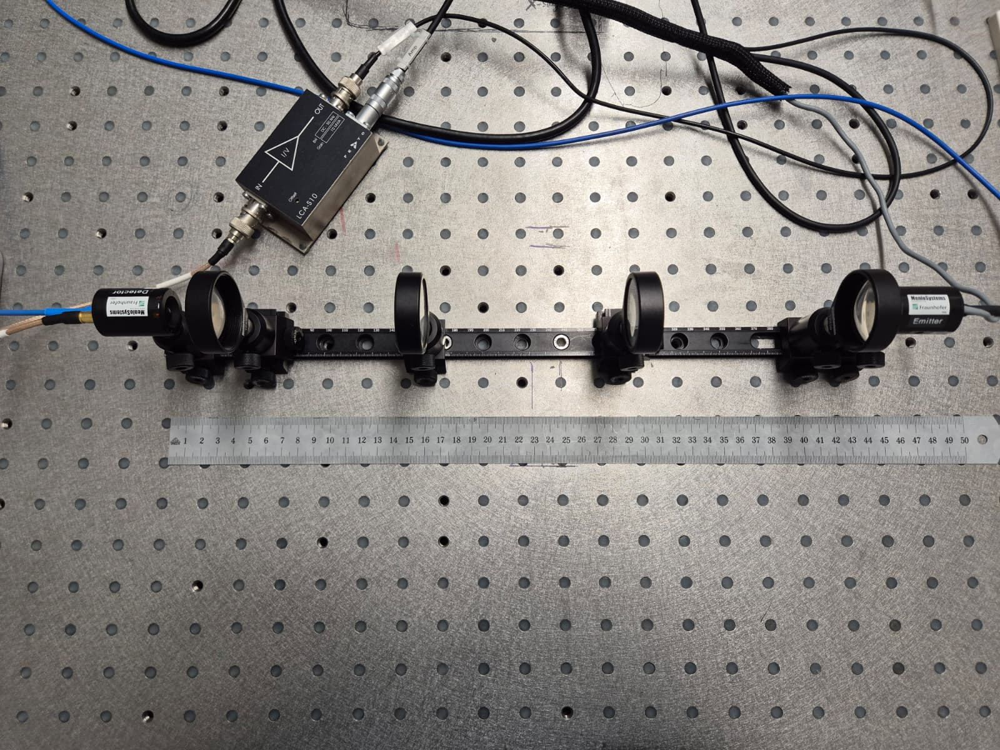
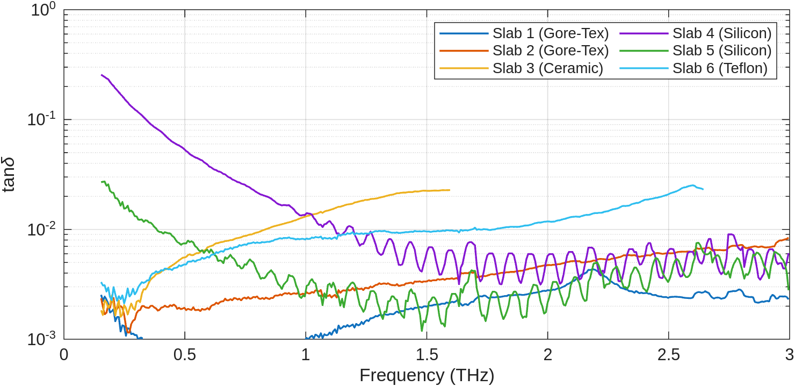
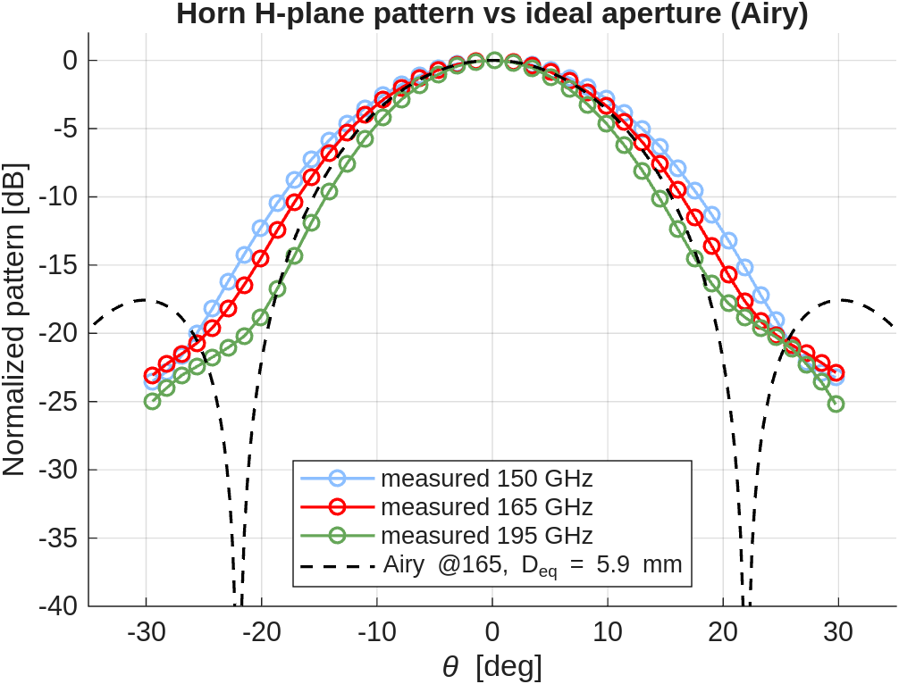

# EE4730 High-Frequency Wireless Architectures

Measurement labs for EE4730 at TU Delft, spanning two measurement domains: THz time-domain spectroscopy for material characterization, and VNA-based antenna characterization at mm-wave frequencies. Both labs pair hands-on bench work (photographed at each step) with MATLAB post-processing. The two submitted reports are at the repository root; each lab keeps its raw data, analysis scripts, and figures.

## Lab 1: THz time-domain spectroscopy

Aligned a free-space THz beam path on an optical bench (Menlo Systems / Fraunhofer emitter and detector, four TPX lenses) and used it to extract the complex permittivity of six dielectric slabs.

The pipeline (`lab1/analysis/lab1_analysis.m`) reads the Menlo ScanControl time traces, FFTs them against a reference, and fits the transfer function of each slab to recover refractive index and loss tangent versus frequency.

The `lab1/pics/` folder documents every alignment step and each sample in the beam, and `lab1/README.md` describes the data-file format and directory layout in detail.

## Labs 2 and 3: mm-wave antenna characterization

Two-port VNA measurements of horn and lens antennas: waveguide calibration, time gating to remove multipath, then extraction of gain, directivity, and radiation patterns. Diagonal scans over the aperture give the near-field and the far-field pattern, compared against the ideal Airy pattern for an equivalent aperture.

Analysis in `lab23_analysis/analysis_main.m` produces coupling, gating, horn gain and pattern, lens directivity and near-field, and probe gain figures. Bench photos of the tx/rx modules and lens antennas are in `lab2/`, `lab3/`, and `lab23_analysis/report/photos/`.

## Oral exam

`oral-exam/` holds the time-domain oral exam deck (built programmatically with `build_deck.py`), speaker notes, and the schematic/transmission-line model assets used to explain the THz photoconductive antenna and the time-domain spectroscopy system.

## Repository layout

| Path | Contents |
| --- | --- |
| `lab1/` | THz TDS: raw traces, slab photos, analysis, report |
| `lab2/`, `lab3/` | VNA antenna measurement data and bench photos |
| `lab23_analysis/` | Combined antenna analysis scripts, figures, report |
| `oral-exam/` | Oral exam slides, notes, and figure assets |
| `EE4730_*_Report_*.pdf` | Submitted lab reports |

Tools: Menlo Systems THz-TDS bench, mm-wave VNA with waveguide cal kit, MATLAB for all post-processing.
